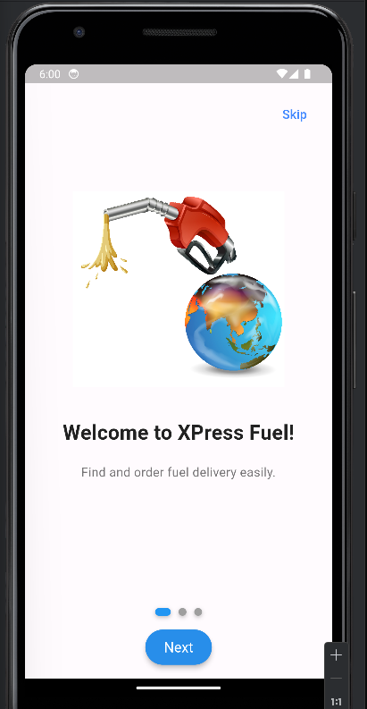
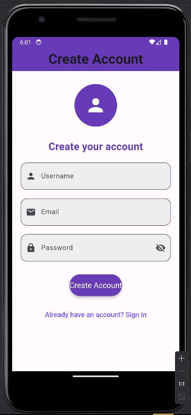
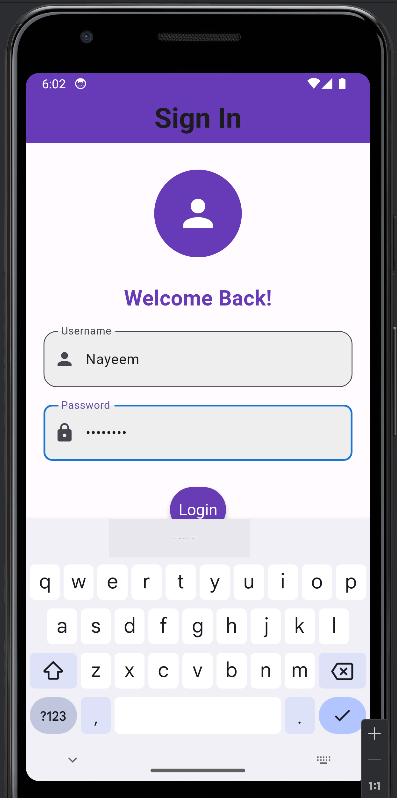
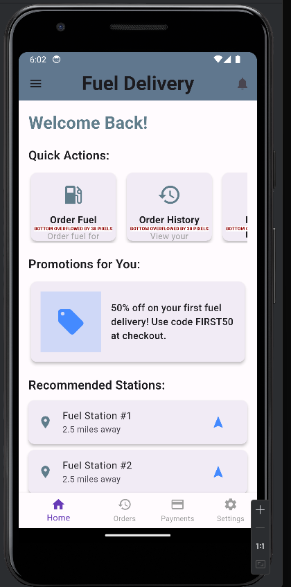
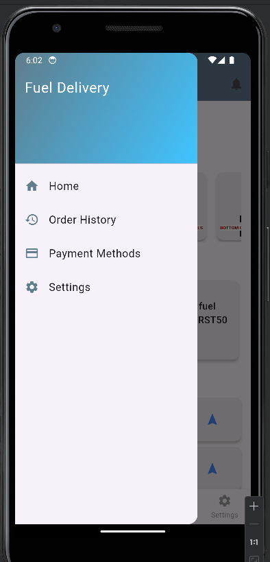
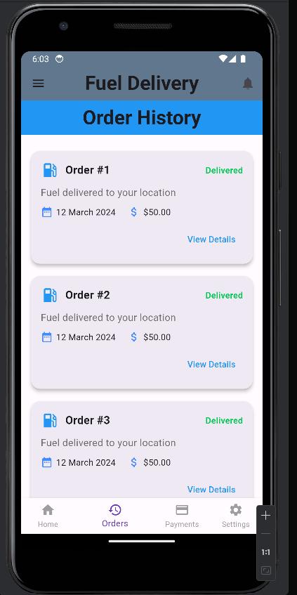
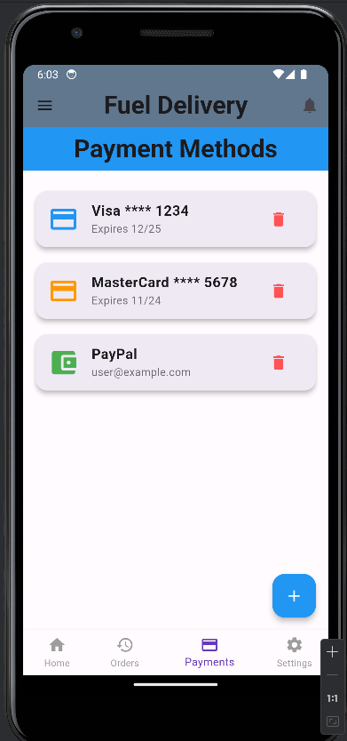
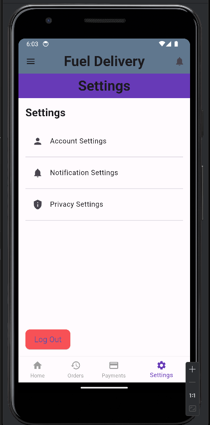

# Fuel Delivery App - Flutter Project

This is a simple Fuel Delivery App built using Flutter. It has features like managing fuel orders, payment methods, settings, and more.

## Features

- **Home Screen**: Displays quick actions, promotions, and recommended stations.
- **Order History**: View past fuel delivery orders.
- **Payment Methods**: Manage your saved payment methods.
- **Settings**: Manage application settings.
- **Navigation**: 
  - Drawer navigation for accessing various sections like Home, Order History, Payment Methods, and Settings.
  - Bottom Navigation Bar for navigating between Home, Orders, Payments, and Settings screens.

## Screens
1. **HomeScreen**: Displays quick actions, promotions, and fuel station recommendations.
2. **OrderHistoryScreen**: Displays the history of fuel deliveries.
3. **PaymentMethodsScreen**: Manages payment methods such as credit cards and PayPal.
4. **SettingsScreen**: Application settings such as account and notification preferences.

## App Screenshots

<div align="center">
  
  
  
  
</div>

<div align="center">
  
  
  
  
</div>


## Getting Started

### Prerequisites

Ensure you have Flutter installed on your machine. You can download Flutter from [here](https://flutter.dev/docs/get-started/install).

### Installing

Clone this repository and navigate to the project folder:

```bash
git clone https://github.com/your-username/fuel-delivery-app.git
cd fuel-delivery-app
```

Install the necessary dependencies:

```bash
flutter pub get
```

### Running the App

To run the app on an emulator or physical device, use the following command:

```bash
flutter run
```

### Folder Structure

```plaintext
lib/
├── main.dart              # App entry point
├── screens/               # Contains all the screens for the app
│   ├── home_screen.dart
│   ├── order_history_screen.dart
│   ├── payment_methods_screen.dart
│   └── settings_screen.dart
├── widgets/               # Contains reusable widgets like ActionCard
└── services/              # Service files (e.g., authentication service)
```

### Built With

- Flutter - The framework used


## Authors

- **Nayeem Islam** - [NoManNayeem](https://github.com/NoManNayeem/TestFlutterApplication.git)

## License

This project is licensed under the MIT License - see the [LICENSE.md](LICENSE.md) file for details.
